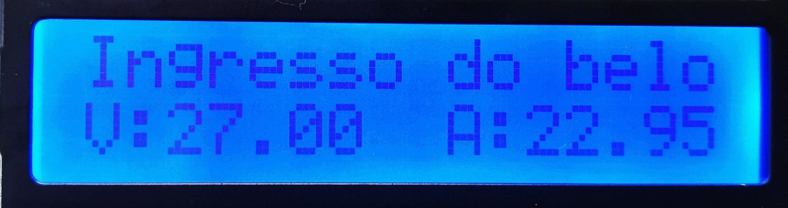
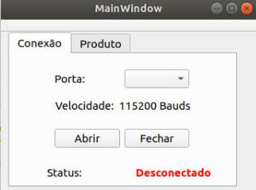
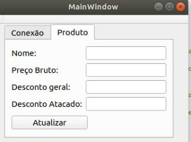
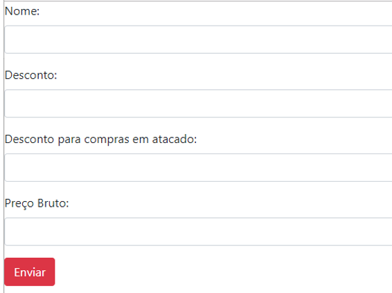

# Etiqueta Digital
Projeto realizado para disciplina de técnicas de programação.

# Sumário

- O que é a Etiqueta Digital?
- Manual do usuário;
- Funcionamento;
- Ficha técnica.

# O que é a Etiqueta Digital?
Observando o funcionamento de um supermercado, constatamos que frequentemente os funcionários precisam alterar os preço dos produtos nas prateleiras, pensando nisso, desenvolvemos uma etiqueta digital que tem como objetivo principal automatizar esta função.

O protótipo da etiqueta digital consiste, basicamente, em uma ESP-12e (NODEMCU V3) que recebe os dados a serem informados e os encaminha para o display LCD. Esses dados serão exibidos em cada prateleira, exibindo o nome do produto, o preço e seus respectivos descontos de varejo e atacado.

Na imagem acima podemos observar um exemplo do funcionamento do programa para o display LCD.

# Manual do Usuário

## Funcionamento da etiqueta
A ideia do projeto é de que o funcionário do supermercado alterar o valor dos seus produtos sem a necessidade de perder tanto tempo e evitar gastos com material. Para isso, será disponibilizado uma interface na qual haverá os campos a serem preenchidos para que o usuário possa inserir os dados do produto. Controlaremos também a necessidade de reposição do estoque na prateleira através de um sensor infravermelho que detecta a ausênci da mercadoria e encaminha uma mensagem identificando que existe a necessidade de reposição.

# Utilizando a etiqueta

A tela de inicial da aplicação do projeto é bastante direta. Primeiro, o usuário deve conectar o seu cabo microUSB da ESP-12e com alguma entrada USB do seu computador. A seguir, deve ser selecionada a porta na qual a placa está conectada. Para que as informações sejam passadas, faz-se necessário ter uma velocidade específica para comunicação que foi definida em 115200 bauds como velocidade padrão. Em seguida, na aba "Etiqueta" é necessário preencher os seguintes dados:

- Nome do produto;
- Preço;
- Desconto geral;
- Desconto em atacado.

Por fim, basta clicar em "Atualizar" e o produto descrito na interface aparecerá no display LCD. Acompanhe a imagem abaixo:

# Etiqueta WEB

Desenvolvemos também uma central WEB que possui as mesmas funções da central offline.

Segue o link para acesso a plataforma online do projeto: http://etiquetadigital.herokuapp.com/

# Ficha técnica
## Materiais utilizados:
- ESP-12e;
- LCD;
- Sensor infravermelho;
- Protoboard;
- Jumpers para conexão.

# O Circuito

Utilizamos um sensor infravermelho do tipo emissor-receptor para a captura das informações do estado da prateleira. A ESP-12e é a peça mais importante do circuito, pois recebe as informações vindas da central e as transfere para o display LCD, assim como também recebe dados do infravermelho e identifica a situação da prateleira.

# Futuras melhorias

- Maior número de informações por etiqueta;
- Inserção de um código de barras;
- Design da interface;

Esperamos que tenha gostado do nosso produto, salientamos que é apenas um protótipo e por isso pode sofrer alterações.
 
 

